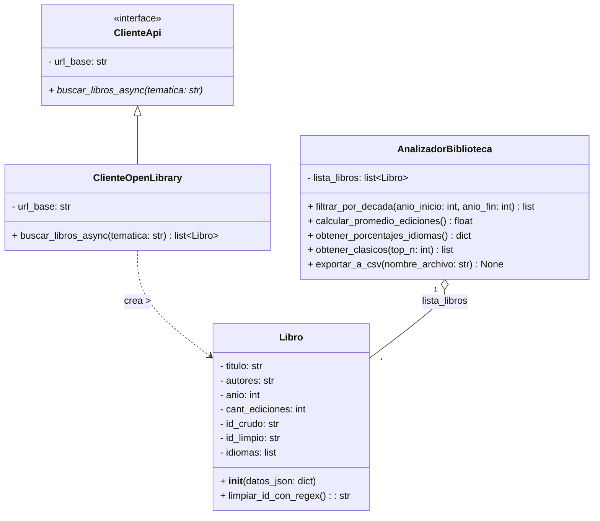

# Proyecto Final: Analizador Crítico de Literatura Científica y Técnica
**Estudiante:** Chiara Martínez  
**Institución:** Universidad Católica del Uruguay (UCU)  
**Materia:** Programación Científica y Técnica  
**Fecha:** Junio 2026  

---

## 1. Descripción del Problema Metodológico

En el ámbito de la investigación científica y la formación académica de vanguardia, la revisión bibliográfica sistemática se enfrenta a dos desafíos metodológicos críticos que pueden comprometer la validez y relevancia de los marcos teóricos construidos:

1. **Índice de Obsolescencia Temporal:** En disciplinas de acelerada evolución (como las ciencias de la computación, inteligencia artificial o biotecnología), el conocimiento técnico experimenta un envejecimiento prematuro. Desarrollar investigaciones basadas en literatura obsoleta introduce riesgos severos de redundancia o invalidez conceptual.
2. **Brecha Lingüística y Sesgo Idiomático:** Existe una marcada asimetría global en la distribución y publicación de la literatura científica, concentrándose la vanguardia de los hallazgos en el idioma inglés. Esto genera una barrera y un retraso crítico para los investigadores de habla hispana que dependen de traducciones o de la escasa producción nativa equivalente.

### Solución Desarrollada
Para auditar y cuantificar estos fenómenos de manera automatizada y en tiempo real, se diseñó e implementó una aplicación interactiva en Python que consume la API global de *Open Library*. El sistema permite ingerir muestras bibliográficas masivas asociadas a cualquier término técnico, procesar sus metadatos estructurales y exponer un dashboard analítico con indicadores clave de vigencia cronológica, fragmentación idiomática e impacto editorial.

---

## 2. Arquitectura del Sistema (Diagrama de Clases UML)

El backend de la aplicación fue estructurado bajo los lineamientos del paradigma de Programación Orientada a Objetos (POO), garantizando un diseño con alta cohesión y bajo acoplamiento mediante la separación nítida de responsabilidades:

### Justificación de las Relaciones y Simbología UML

* **Herencia / Realización (`<|--`):** Representada por el vector con punta triangular vacía. La clase concreta `ClienteOpenLibrary` hereda e implementa la interfaz abstracta `ClienteApi`. Este diseño aísla la infraestructura de red de la lógica analítica, permitiendo sustituir el proveedor de datos en el futuro (por ejemplo, Google Books o Scopus) sin alterar una sola línea del resto del sistema.
* **Dependencia de Creación (`..>`):** El cliente de red tiene la responsabilidad exclusiva de interactuar con los servicios web externos, recibir los objetos JSON e instanciar dinámicamente las colecciones de tipo `Libro`.
* **Agregación Débil (`o--`):** Representada por el rombo sin pintar (blanco) apuntando a `AnalizadorBiblioteca`. Indica una relación estructural de uno a muchos donde el analizador tiene una lista de libros. Se seleccionó la agregación en lugar de la composición debido a que las instancias de `Libro` poseen un ciclo de vida independiente; los datos no son propiedad exclusiva del analizador y pueden persistir o ser transferidos aunque el motor analítico sea destruido o reiniciado en la interfaz de usuario.

---

## 3. Cumplimiento de Requerimientos Técnicos y Buenas Prácticas

### A. Modularización y Estructura de Archivos
El software implementa un diseño modular estricto dividiendo sus responsabilidades en archivos independientes:
* **`models.py` (Capa de Dominio):** Contiene la abstracción y el moldeado de los datos atómicos del sistema a través de la clase `Libro`.
* **`api_client.py` (Capa de Infraestructura):** Gestiona de forma exclusiva las conexiones de red, el ciclo de vida de las peticiones HTTP y el consumo de la API.
* **`analyzer.py` (Capa de Negocio):** Funciona como el motor analítico central del sistema, encargado de procesar colecciones de datos y computar los indicadores matemáticos.
* **`test_project.py` (Capa de Calidad):** Suite de pruebas unitarias automatizadas encargada de garantizar el correcto comportamiento del backend bajo escenarios ideales y anómalos.
* **`app.py` (Capa de Presentación):** Orquesta los flujos de Streamlit, manejando la persistencia de los estados lógicos de la UI mediante `st.session_state`.

### B. Consumo de API y Concurrencia Asíncrona
Para optimizar las operaciones de Entrada/Salida bloqueantes (I/O-bound) inherentes a las consultas sobre la red de internet, se descartó el uso de librerías síncronas convencionales. En su lugar, se implementó concurrencia cooperativa asíncrona utilizando las librerías `aiohttp` y `asyncio`. Al invocar el método `buscar_libros_async`, el sistema libera de inmediato el hilo principal de ejecución mientras espera el arribo del payload del servidor externo, asegurando que la interfaz interactiva permanezca completamente fluida y reactiva para el usuario.

### C. Programación Defensiva y Validación con Expresiones Regulares
El backend asume un criterio de desconfianza ante los datos externos. Las claves de identidad de las obras son devueltas por la API embebidas en rutas URL complejas y ruidosas (ej: `/works/OL27479W`). Para resolver esto, se codificó el método `limpiar_id_con_regex()`, el cual explota el uso del módulo nativo `re` para validar la morfología formal de la cadena y extraer estrictamente el código alfanumérico limpio. Ante un identificador corrupto, el sistema arroja un `ValueError` controlado que aísla el registro sin interrumpir el pipeline.

Adicionalmente, el constructor de `Libro` implementa atenuación de nulidad estructural: si la API provee un registro incompleto desprovisto de años de publicación, autores o cantidad de ediciones, el sistema intercepta la falta de datos asignando constantes seguras por defecto (`0` para campos numéricos y `"N/D"` para cadenas), previniendo excepciones por incompatibilidad de tipos (`TypeError`) durante el procesamiento estadístico.

### D. Paradigma de Programación Funcional
El motor estadístico implementado en `analyzer.py` prioriza el diseño declarativo sobre los enfoques imperativos iterativos tradicionales, garantizando la inmutabilidad de las colecciones de datos en memoria y eliminando efectos secundarios:
* **Métrica A (Vigencia Temporal):** Combina la función de orden superior `filter()` con expresiones `lambda` evaluadas dinámicamente para segmentar cronológicamente la muestra en rangos de décadas sin recurrir a bucles e incrementos mutables.
* **Métrica C (Clásicos Técnicos):** Utiliza de forma compacta e integrada funciones puras como `map()` y `sum()` para computar el promedio del volumen histórico de reediciones físicas publicadas, aislando los elementos con mayor impacto mediante ordenamientos puros con `sorted()`.

### E. Persistencia Local y Gestión de Reportes
El analizador procesa las colecciones validadas en memoria y las acopla con métodos de persistencia local a través del formato estándar CSV (valores separados por punto y coma `;`), permitiendo a los investigadores exportar y descargar las muestras depuradas directamente desde la aplicación para auditorías externas en herramientas analíticas locales.

---

## 4. Registro de Decisiones Técnicas y Calidad de Software

1. **Optimización del Ancho de Banda:** Se configuraron parámetros restrictivos en las solicitudes de la API para exigir exclusivamente los campos requeridos por el modelo de datos. Esto minimiza el tamaño del payload JSON de respuesta, reduciendo drásticamente la latencia de red y el consumo de memoria del sistema.
2. **Consideraciones Éticas Digitales:** Se inyectó explícitamente una cabecera HTTP personalizada (`User-Agent` único e identificable) en las peticiones del cliente asíncrono. En el desarrollo profesional de software, esto constituye una buena práctica ética mandatoria que permite a los administradores de los servidores públicos auditar de forma transparente el tráfico de nuestra aplicación, previniendo bloqueos automatizados.

